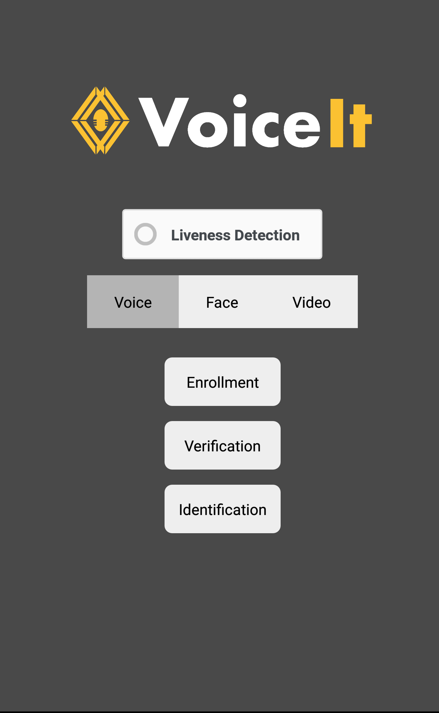

# Voiceit API 2.0 React Native Demo and Module

The react-native module uses the Android and IOS SDKs to provide voice, video, and face enrollment/verification/identification functionalities that can be easily implemented in react native projects. Please look at the SDKs for <a href="https://github.com/voiceittech/VoiceItApi2AndroidSDK">Andoird</a> or <a href="https://github.com/voiceittech/VoiceItApi2AndroidSDK">IOS</a> for further information

* [Demo](#demo)
     * [Screenshots](#screenshots)
          * [Android](#android)
          * [IOS](#ios)
  * [Credentials](#credentials)
  * [Configuration](#configuration)
  * [Running the Demo](#running-the-demo)
* [Incorporating the Module](#incorporating-the-module)
    * [Android](#android-module)
        * [Get the Module](#get-the-module)
        * [Initialize Module](#initialize-module)
        * [Access Module Methods](#access-module-methods)
            * [Initialize Module](#initialize-the-module)
        * [Encapsulated Action Methods](#encapsulated-action-methods)
        * [API Wrapper Methods](#api-wrapper-methods)
    * [IOS](#ios-module)

## Demo 
### Screenshots 



#### Android 


#### IOS

Coming soon!
### Credentials
Before unpacking the repo, please make sure to create a Developer account at https://voiceit.io/signup. Upon completion,
login and navigate to the "Settings tab" to view your Api Key and Token, both of which will be needed later on. Also, navigate to the "User Management" tab and click "Create a User". This will create a user with a User ID which will be used later on for the examples.
### React Native CLI
Please make sure you have Node JS isntalled. We can use npm to easily get the react-native cli: 
```
npm install -g react-native-cli
```
This is required to pack and run the application.
### Configuration
Please open thie file App.js, inside the root folder voiceItReactNative. From line 9 onwards, edit the options object to add details such as your api key and token, user id you are testing for, a group id, content language, and phrase: 
```
const options = {
  user_id: "USER_ID_HERE",
  group_id: "GROUP_ID_HERE",
  content_language: "CONTENT_LANGUAGE_HERE",
  phrase: "PHRASE_HERE",
  apiKey: "API_KEY_HERE",
  apiToken: "API_TOKEN_HERE",
  liveness: false
  };
  ```
### Running the Demo
After the configuration step, open terminal/cmd and cd into the folder voiceItReactNative. We have to install the react-native modules before running the application. Type: 
```
npm install
```
Please connect your device to your machine. 
<ul>
 <li>Android: 
  Please make sure you have the <a href="https://developer.android.com/studio/">Android developement environemnt set up</a>, and Android SDK 9 (Pie) installed.
From the main project folder, run the applicaion by typing this in terminal/cmd
  
```
react-native run-android 
```

<li>IOS:
    Coming Soon!

 </li>
</ul>


### Incorporating the Module

#### Android Module

##### Get the Module
Since react native compiles into native android code, the voiceiteReactNative Android library/Module has to be used. Please open the android project folder in android studio; $your_project_root_folder/android. We recommend using <a href="https://jitpack.io/#hismaeel/VRNA">Jitpack</a> <br>

##### Initialize Module
After getting the module through jutpack, natigate to app/src/main/java/$package_name/MainApplication. Look for the method getPackages(), which should look something like this: 
```
    @Override
    protected List<ReactPackage> getPackages() {
      return Arrays.<ReactPackage>asList(
          new MainReactPackage(),
          //add the voiceItPackage
              new voiceItPackage());
    }
 ```
  Add initialize a new instance of the voiceItPackage, as shown above. This will initilize the native methods in the module. 
 
##### Access Module methods
To access the module methods, naviagte to $Your_Project_Root/App.js. The Module will be wrapped up inside react native's built-in <a href="https://facebook.github.io/react-native/docs/native-modules-ios"> Native Modules</a> object. 
Inside App.js, import the Native Modules: 
```
import {NativeModules} from 'react-native';
```
We recommending creating an instance of the Voice It Module; 
```
const voiceItModule = NativeModules.VoiceIt;
```
###### Initialize the Module 
```
voiceItModule.initVoiceIt("API_KEY_HERE", "API_KEY_HERE");
```
##### Encapsulated Action Methods 

###### Start Voice Enrollment
```
voiceItModule.encapsulatedVoiceEnrollment("USER_ID", "CONTENT_LANGUAGE", "PHRASE", (res)=>{
    //This is the Callback. Handle result here }
);
```
###### Start Voice Verification
```
voiceItModule.encapsulatedVoiceVerification("USER_ID", "CONTENT_LANGUAGE", "PHRASE", (res)=>{
    //This is the Callback. Handle result here }
);
```
###### Start Voice Identification 
```
voiceItModule.encapsulatedVoiceIdentification("GROUP_ID", "CONTENT_LANGUAGE", "PHRASE", (res)=>{
    //This is the Callback. Handle result here }
);
```

###### Start Face Enrollment
```
voiceItModule.encapsulatedFaceEnrollment("USER_ID",(res)=>{
    //This is the Callback. Handle result here }
);
```
###### Start Face Verification
```
voiceItModule.encapsulatedFaceVerification("USER_ID", LIVENESS_BOOLEAN, (res)=>{
    //This is the Callback. Handle result here }
);
```

###### Start Face Identification 
```
voiceItModule.encapsulatedFaceIdentification("GROUP_ID", LIVENESS_BOOLEAN, (res)=>{
    //This is the Callback. Handle result here }
);
```

###### Start Video Enrollment
```
voiceItModule.encapsulatedVideoEnrollment("USER_ID", "CONTENT_LANGUAGE", "PHRASE", (res)=>{
    //This is the Callback. Handle result here }
);
```

###### Start Video Verification
```
voiceItModule.encapsulatedVideoVerification("USER_ID", "CONTENT_LANGUAGE", LIVENESS_BOOLEAN, "PHRASE", (res)=>{
    //This is the Callback. Handle result here }
);
```

###### Start Video Identification 
```
voiceItModule.encapsulatedVideoIdentification("GROUP_ID", "CONTENT_LANGUAGE", LIVENESS_BOOLEAN, "PHRASE", (res)=>{
    //This is the Callback. Handle result here }
);
```

##### API Wrapper Methods
This is an incomplete List. For a list of all methods, please look at the <a href="https://github.com/voiceittech/VoiceItApi2AndroidSDK#user-api-calls"> Android SDK</a> documentation

###### Get All Users 
```
voiceItModule.getAllUsers(res)=>{
    //This is the Callback. Handle result here }
);
```
###### Create User
```
voiceItModule.createUser(res)=>{
    //This is the Callback. Handle result here }
);
```
###### Check User Exists
```
voiceItModule.checkUserExists("USER_ID_HERE", res)=>{
    //This is the Callback. Handle result here }
);
```
###### Delete user 
```
voiceItModule.deleteUser("USER_ID_HERE", res)=>{
    //This is the Callback. Handle result here }
);
```
###### Get Groups For User
```
voiceItModule.getGroupsForUser("USER_ID_HERE", res)=>{
    //This is the Callback. Handle result here }
);
```
###### Get All Groups 
```
voiceItModule.deleteUser(res)=>{
    //This is the Callback. Handle result here }
);
```
###### Get Group 
```
voiceItModule.getGroup("USER_ID_HERE", res)=>{
    //This is the Callback. Handle result here }
);
```
###### Check Group Exists 
```
voiceItModule.groupExists("USER_ID_HERE", res)=>{
    //This is the Callback. Handle result here }
);
```
###### Create Group 
```
voiceItModule.createGroup("GROUP_DESCRIPTION", res)=>{
    //This is the Callback. Handle result here }
);
```
###### Add User to Group
```
voiceItModule.addUserToGroup("GROUP_ID","USER_ID", res)=>{
    //This is the Callback. Handle result here }
);
```

###### Remove User From Group
```
voiceItModule.removeUserFromGroup("GROUP_ID","USER_ID", res)=>{
    //This is the Callback. Handle result here }
);
```
###### Delete group
```
voiceItModule.deleteGroup("GROUP_ID_HERE", res)=>{
    //This is the Callback. Handle result here }
);
```


#### IOS Module
Coming soon!
